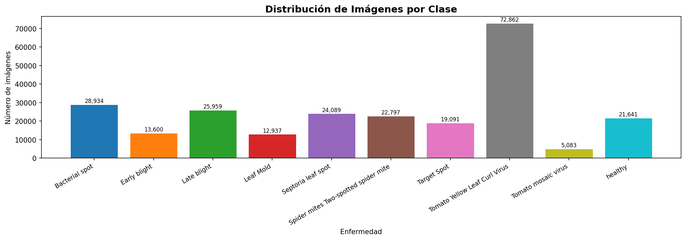
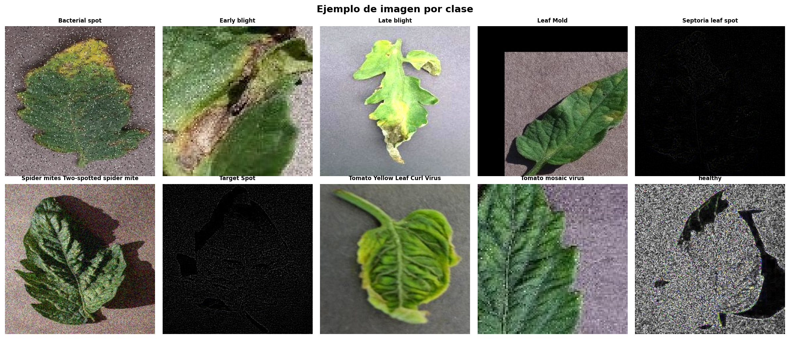

# Clasificación Automática de Enfermedades en Hojas de Tomate mediante Redes Neuronales Convolucionales y Transfer Learning

**Asignatura:** Inteligencia Artificial  
**Dataset:** Plant Village Augmented — Tomato Leaf Diseases  
**Tecnología principal:** PyTorch 2.8 · ResNet50 · CUDA 12.8  

---

## Índice

1. [Resumen](#resumen)
2. [Introducción](#introduccion)
   - 2.1 Contexto y motivación
   - 2.2 Presentación del problema
   - 2.3 Objetivos
3. [Marco Teórico](#marco-teorico)
   - 3.1 Inteligencia Artificial y Aprendizaje Automático
   - 3.2 Aprendizaje Profundo (Deep Learning)
   - 3.3 Redes Neuronales Convolucionales (CNN)
   - 3.4 Transfer Learning
   - 3.5 ResNet50 y las conexiones residuales
4. [Stack Tecnológico](#stack)
5. [Desarrollo del Proyecto](#desarrollo)
   - 5.1 Dataset
   - 5.2 Análisis exploratorio
   - 5.3 Preprocesamiento y aumentación de datos
   - 5.4 Arquitectura del modelo
   - 5.5 Estrategia de entrenamiento
   - 5.6 Gestión del desbalance de clases
6. [Resultados](#resultados)
   - 6.1 Curvas de entrenamiento
   - 6.2 Métricas globales
   - 6.3 Rendimiento por clase
   - 6.4 Matriz de confusión
   - 6.5 Análisis de errores
7. [Discusión](#discusion)
8. [Conclusiones](#conclusiones)
9. [Trabajo Futuro](#trabajo-futuro)
10. [Bibliografía](#bibliografia)

---

## 1. Resumen <a name="resumen"></a>

En este proyecto se desarrolla un sistema de **clasificación automática de enfermedades en hojas de tomate** aplicando técnicas de aprendizaje profundo. Se emplea Transfer Learning sobre la arquitectura ResNet50 preentrenada en ImageNet, adaptada mediante un proceso de fine-tuning en dos fases sobre el dataset Plant Village Augmented, que contiene **246.993 imágenes** distribuidas en **10 clases** (9 enfermedades y planta sana).

El modelo final alcanza una **accuracy del ~96%** en el conjunto de test y un **F1-score macro de ~0.933**, con 9 de las 10 clases superando un F1 de 0.90. Estos resultados demuestran la viabilidad del aprendizaje profundo como herramienta de diagnóstico fitosanitario automatizado.

---

## 2. Introducción <a name="introduccion"></a>

### 2.1 Contexto y motivación

El tomate (*Solanum lycopersicum*) es uno de los cultivos hortícolas más importantes a nivel mundial. Según la FAO, se producen anualmente más de 180 millones de toneladas, siendo un alimento básico en la dieta mediterránea y fuente de ingresos para millones de agricultores. Sin embargo, las enfermedades foliares suponen una amenaza constante para estos cultivos: infecciones bacterianas, fúngicas y víricas pueden reducir el rendimiento de una cosecha entre un 20% y un 80% si no se detectan y tratan a tiempo.

El diagnóstico tradicional de enfermedades depende de la inspección visual realizada por expertos agrónomos, un proceso que es:
- **Lento:** requiere desplazamiento físico al campo y análisis manual
- **Costoso:** los técnicos especializados no están al alcance de todos los agricultores
- **Subjetivo:** sujeto a errores humanos, especialmente en fases tempranas de la enfermedad
- **Poco escalable:** imposible de aplicar a grandes extensiones de cultivo de forma sistemática

La inteligencia artificial, y en particular el aprendizaje profundo aplicado a la visión por computador, ofrece una alternativa automatizada, escalable y de bajo coste.

### 2.2 Presentación del problema

El problema se enmarca como una tarea de **clasificación multiclase supervisada sobre imágenes**: dado que el sistema recibe como entrada una fotografía de una hoja de tomate, debe predecir a cuál de las siguientes 10 categorías pertenece:

| ID | Clase | Tipo |
|----|-------|------|
| 0 | Bacterial Spot | Enfermedad bacteriana |
| 1 | Early Blight | Enfermedad fúngica |
| 2 | Healthy | Planta sana |
| 3 | Late Blight | Enfermedad fúngica/oomiceto |
| 4 | Leaf Mold | Enfermedad fúngica |
| 5 | Septoria Leaf Spot | Enfermedad fúngica |
| 6 | Spider Mites | Plaga (ácaro) |
| 7 | Target Spot | Enfermedad fúngica |
| 8 | Tomato Mosaic Virus | Enfermedad vírica |
| 9 | Tomato Yellow Leaf Curl Virus | Enfermedad vírica |

La correcta distinción entre estas clases tiene implicaciones directas en el tratamiento a aplicar: un fungicida es ineficaz contra una infección bacteriana, y un insecticida contra una enfermedad vírica. Una clasificación errónea puede llevar a tratar incorrectamente la planta y a su pérdida.

### 2.3 Objetivos

**Objetivo general:**  
Desarrollar y evaluar un modelo de clasificación automática de enfermedades en hojas de tomate basado en redes neuronales convolucionales con Transfer Learning.

**Objetivos específicos:**
- Analizar y caracterizar el dataset Plant Village Augmented, incluyendo su distribución de clases y estructura
- Implementar una pipeline completa de aprendizaje profundo: preprocesamiento, entrenamiento, validación y evaluación
- Aplicar Transfer Learning con ResNet50 mediante una estrategia de entrenamiento en dos fases
- Gestionar el desbalance de clases presente en el dataset
- Evaluar el modelo con métricas apropiadas para clasificación multiclase: accuracy, F1-score por clase, matriz de confusión
- Analizar cualitativamente los errores del modelo

---

## 3. Marco Teórico <a name="marco-teorico"></a>

### 3.1 Inteligencia Artificial y Aprendizaje Automático

La **Inteligencia Artificial (IA)** es la rama de la informática que estudia el desarrollo de sistemas capaces de realizar tareas que, realizadas por humanos, requerirían inteligencia. Dentro de la IA, el **Aprendizaje Automático** (*Machine Learning*, ML) es el paradigma en el que los sistemas aprenden patrones a partir de datos, sin ser programados explícitamente con reglas.

En el aprendizaje automático supervisado, el modelo aprende a partir de ejemplos etiquetados (pares entrada-salida). En nuestro caso, los ejemplos son imágenes de hojas de tomate y sus etiquetas son los nombres de las enfermedades. El modelo ajusta sus parámetros internos para minimizar el error entre sus predicciones y las etiquetas reales.

### 3.2 Aprendizaje Profundo (Deep Learning)

El **Aprendizaje Profundo** (*Deep Learning*) es una subcategoría del aprendizaje automático que utiliza **redes neuronales artificiales con múltiples capas** (de ahí el término "profundo") (LeCun, Bengio y Hinton 2015; Goodfellow, Bengio y Courville 2016). Cada capa aprende representaciones cada vez más abstractas de los datos:

```
Entrada (píxeles) → bordes → texturas → partes → objetos → clase
      Capa 1          Capa 2    Capa 3     Capa 4    Capa N
```

Esta capacidad de aprender representaciones jerárquicas hace que el deep learning sea especialmente adecuado para datos no estructurados como imágenes, audio o texto, donde las características relevantes no son obvias a priori.

La función que el modelo aprende a minimizar se denomina **función de pérdida** (*loss function*). En clasificación multiclase se utiliza la **Cross-Entropy Loss**:

$$\mathcal{L} = -\sum_{i=1}^{C} y_i \log(\hat{y}_i)$$

donde $y_i$ es la etiqueta real (en formato one-hot) y $\hat{y}_i$ es la probabilidad predicha por el modelo para la clase $i$.

### 3.3 Redes Neuronales Convolucionales (CNN)

Las **Redes Neuronales Convolucionales** (CNN, del inglés *Convolutional Neural Networks*) son el tipo de arquitectura de deep learning diseñada específicamente para procesar datos con estructura espacial, como las imágenes (Krichen 2023).

Su componente principal es la **capa convolucional**, que aplica filtros (kernels) sobre la imagen para detectar patrones locales. A diferencia de las redes densas, las capas convolucionales tienen tres propiedades clave:

1. **Compartición de pesos:** el mismo filtro se aplica sobre toda la imagen, reduciendo drásticamente el número de parámetros
2. **Localidad:** cada neurona solo "ve" una región local de la imagen (*campo receptivo*)
3. **Invarianza traslacional:** un patrón aprendido en una esquina de la imagen se detecta también en el centro

Una CNN típica alterna capas convolucionales (extracción de características) con capas de pooling (reducción de dimensionalidad) y termina con capas densas (clasificación):

```
[Imagen] → [Conv+ReLU] → [Pooling] → [Conv+ReLU] → [Pooling] → [Flatten] → [Dense] → [Softmax]
```

La **función de activación ReLU** (*Rectified Linear Unit*), $f(x) = \max(0, x)$, introduce no-linealidad en la red y es la más utilizada en capas intermedias de CNNs modernas.

### 3.4 Transfer Learning

**Transfer Learning** (aprendizaje por transferencia) es la técnica mediante la cual un modelo entrenado para una tarea se reutiliza como punto de partida para otra tarea diferente (Plested, Phiri y Gedeon 2022).

En visión por computador, los modelos preentrenados en **ImageNet** (dataset de 1,2M imágenes y 1000 clases) han aprendido detectores de características visuales muy generales que son transferibles a prácticamente cualquier tarea de clasificación de imágenes. Esto es posible porque:

- Las primeras capas aprenden características universales (bordes, gradientes, colores)
- Las capas intermedias aprenden texturas y patrones más complejos
- Solo las últimas capas son específicas de la tarea original

El proceso de Transfer Learning en este proyecto se estructura en dos fases:

**Fase 1 — Feature Extraction:**  
Se congela el backbone (todas las capas excepto la última) y solo se entrena la nueva cabeza clasificadora. Esto permite aprender la correspondencia entre las características ya extraídas y las nuevas clases sin riesgo de destruir el conocimiento previo.

**Fase 2 — Fine-tuning:**  
Se descongelan todas las capas y se reentrena toda la red con un learning rate muy reducido. Esto permite que el backbone se adapte sutilmente a las características específicas del nuevo dominio (hojas de tomate) sin olvidar lo aprendido en ImageNet.

### 3.5 ResNet50 y las conexiones residuales

**ResNet50** (He et al. 2016) es una CNN de 50 capas que introduce las **conexiones residuales** (*skip connections*) para solucionar el problema del gradiente desvaneciente en redes muy profundas.

En una red convencional, el gradiente se multiplica en cada capa durante la retropropagación y tiende a hacerse extremadamente pequeño en las primeras capas, impidiendo su aprendizaje. Las conexiones residuales solucionan esto añadiendo un "atajo" que suma la entrada de un bloque a su salida:

```
       ┌─────────────┐
x ─────┤ Conv+BN+ReLU ├──── F(x)
  │    └─────────────┘        │
  └─────────── + ─────────────┘
               │
             H(x) = F(x) + x
```

La red aprende la función residual $F(x) = H(x) - x$ en lugar de aprender $H(x)$ directamente. Si la transformación óptima es la identidad, la red simplemente aprende $F(x) = 0$, algo mucho más fácil que aprender a replicar la identidad con capas convolucionales.

ResNet50 tiene **~23,5 millones de parámetros** y alcanza un top-5 error del 6,7% en ImageNet, siendo uno de los modelos de referencia en el campo.

---

## 4. Stack Tecnológico <a name="stack"></a>

| Tecnología | Versión | Rol en el proyecto |
|------------|---------|-------------------|
| **Python** | 3.9.13 | Lenguaje de programación principal |
| **PyTorch** | 2.8.0+cu128 | Framework de deep learning; define el modelo, el entrenamiento y la inferencia |
| **torchvision** | 0.23.0 | Modelos preentrenados (ResNet50), transforms de imágenes y utilidades de visión |
| **CUDA** | 12.8 | Interfaz de NVIDIA para computación paralela en GPU; permite acelerar el entrenamiento |
| **NumPy** | 2.0.2 | Operaciones matriciales y numéricas eficientes |
| **Pillow (PIL)** | 11.3.0 | Carga y manipulación de imágenes desde disco |
| **scikit-learn** | 1.6.1 | Métricas de evaluación (F1, matriz de confusión), split estratificado del dataset |
| **Matplotlib** | 3.9.4 | Visualización de gráficas: curvas de entrenamiento, distribución de clases |
| **Seaborn** | 0.13.2 | Visualización avanzada de la matriz de confusión (heatmaps) |
| **pandas** | 2.3.3 | Análisis tabular de la distribución del dataset |
| **tqdm** | 4.67.3 | Barras de progreso durante el entrenamiento |
| **Jupyter** | 7.5.6 | Entorno de desarrollo interactivo en formato notebook |
| **kagglehub** | 0.3.13 | Descarga automática del dataset desde Kaggle |

**Hardware utilizado:**
- GPU: NVIDIA GeForce RTX 5080 (arquitectura Blackwell, 16 GB VRAM)
- CUDA Driver: 596.36

**Decisiones de entorno:**
- Se utilizó **Python 3.9** (en lugar de 3.14, disponible en el sistema) por compatibilidad con PyTorch y el ecosistema de librerías científicas.
- **PyTorch 2.8 con CUDA 12.8** fue necesario específicamente para soportar la arquitectura Blackwell de la RTX 5080, que requiere controladores actualizados.
- El entrenamiento con **Mixed Precision (FP16)** mediante `torch.amp` permite reducir el consumo de VRAM a la mitad y acelerar los cálculos en GPU modernas, sin pérdida significativa de precisión.

---

## 5. Desarrollo del Proyecto <a name="desarrollo"></a>

### 5.1 Dataset

Se utilizó el dataset **"Tomato Leaf Diseases — Plant Village Augmented Data"**, disponible en Kaggle (Basak 2024). Es una versión aumentada del benchmark original Plant Village (Hughes y Salathé 2015), que contiene imágenes de plantas bajo condiciones controladas de laboratorio.

**Características principales:**
- **246.993 imágenes** totales
- **10 clases** (9 enfermedades + planta sana)
- Resolución original variable, procesada a 224×224 píxeles
- Formato: JPEG/PNG en color RGB

El dataset se organiza en una estructura jerárquica de tres niveles: clase → tipo de aumentación → imágenes. Cada imagen original ha sido procesada con **17 tipos de aumentación** distintos, entre ellos: ajuste de brillo, contraste, saturación, ruido gaussiano, sal y pimienta, rotación, traslación, recorte, espejo horizontal y vertical, ecualización de histograma, y filtros de procesamiento de imagen (Sobel, Laplaciano, High Pass, Unsharp Mask).

### 5.2 Análisis exploratorio

Antes de entrenar, se realizó un análisis exploratorio que reveló dos aspectos críticos:

**Distribución de clases:**



El análisis mostró un **desbalance significativo**: la clase Yellow Leaf Curl Virus concentra el 29,5% de todas las imágenes (72.862), mientras que Tomato Mosaic Virus representa solo el 2,1% (5.083 imágenes). La ratio máximo/mínimo es de 14,3x, lo cual puede sesgar el entrenamiento hacia las clases mayoritarias si no se toman medidas correctoras.

**Visualización de muestras:**



La inspección visual de las muestras confirmó que algunas enfermedades producen síntomas visualmente similares, lo que anticipa posibles confusiones del modelo entre clases como Bacterial Spot y Septoria Leaf Spot (ambas generan manchas pequeñas oscuras) o Early Blight y Target Spot (manchas con anillos concéntricos).

### 5.3 Preprocesamiento y aumentación de datos

**División del dataset:**

El dataset se dividió de forma estratificada en tres conjuntos:

| Conjunto | Proporción | Imágenes | Uso |
|----------|-----------|----------|-----|
| Train | 70% | 172.895 | Ajuste de parámetros del modelo |
| Validación | 15% | 37.049 | Monitorización y selección del mejor modelo |
| Test | 15% | 37.049 | Evaluación final e independiente |

La estratificación garantiza que la distribución de clases se mantiene proporcional en los tres conjuntos, evitando que alguna clase quede infrarrepresentada en el test.

**Transformaciones aplicadas:**

En aprendizaje profundo, el preprocesamiento de imágenes cumple dos funciones distintas: **estandarizar la entrada** para que el modelo reciba siempre datos en el mismo formato, y **aumentar artificialmente la variabilidad** del conjunto de entrenamiento para mejorar la capacidad de generalización. Por este motivo, se aplican transformaciones diferentes según el conjunto:

#### Conjunto de entrenamiento

Cada imagen pasa por la siguiente cadena de transformaciones antes de ser procesada por el modelo:

**1. `Resize(256×256)` — Redimensionado previo**  
Todas las imágenes del dataset tienen resoluciones variables. Se redimensionan a 256×256 píxeles, un tamaño ligeramente mayor que la entrada final del modelo, para permitir el recorte aleatorio del siguiente paso sin perder información.

**2. `RandomCrop(224×224)` — Recorte aleatorio**  
Se extrae un fragmento aleatorio de 224×224 píxeles de la imagen redimensionada. Esto implica que en cada época el modelo ve una región ligeramente diferente de la misma hoja, simulando variaciones en el encuadre de la fotografía. ResNet50 espera imágenes de exactamente 224×224, tamaño estándar heredado de los modelos preentrenados en ImageNet.

**3. `RandomHorizontalFlip()` — Volteo horizontal**  
Con probabilidad del 50%, la imagen se invierte horizontalmente (efecto espejo). Esta transformación está justificada porque una enfermedad foliar se manifiesta de forma idéntica independientemente de si la hoja apunta a la derecha o a la izquierda. Duplica la variabilidad sin introducir ninguna distorsión semántica.

**4. `RandomRotation(±15°)` — Rotación aleatoria**  
La imagen se rota un ángulo aleatorio de hasta 15 grados. En la práctica, una fotografía tomada en campo raramente está perfectamente alineada. Esta transformación enseña al modelo a reconocer los síntomas de la enfermedad independientemente de la orientación de la hoja, haciéndolo más robusto en condiciones reales.

**5. `ColorJitter(brightness, contrast, saturation, hue)` — Variación de color**  
Se aplican perturbaciones aleatorias en brillo, contraste, saturación y matiz de color dentro de rangos controlados. Esto simula distintas condiciones de iluminación (sol directo, sombra, fotografía con flash, distintas horas del día) y evita que el modelo aprenda a depender de un tono de verde específico para identificar una hoja sana.

**6. `ToTensor()` — Conversión a tensor**  
Transforma la imagen de formato PIL (valores enteros 0–255 por canal) a un tensor de PyTorch con valores en punto flotante normalizados en el rango [0, 1]. Esto es imprescindible para que el framework pueda realizar operaciones matemáticas sobre los datos.

**7. `Normalize(μ, σ)` — Normalización estadística**  
Es la transformación más importante desde el punto de vista del Transfer Learning. Se aplica la siguiente operación canal a canal:

$$x_{norm} = \frac{x - \mu}{\sigma}$$

Los valores utilizados son los de ImageNet: μ = [0.485, 0.456, 0.406] y σ = [0.229, 0.224, 0.225] para los canales R, G y B respectivamente. Estos valores reflejan la distribución estadística de los millones de imágenes con las que fue entrenada ResNet50. Si no se aplicara esta normalización, los pesos preentrenados recibirían una distribución de entrada completamente diferente a la que esperan, degradando drásticamente el rendimiento del Transfer Learning.

#### Conjuntos de validación y test

Para estos conjuntos **no se aplican transformaciones aleatorias**. El objetivo es obtener predicciones reproducibles y comparables: si se aplicaran recortes o rotaciones aleatorias, la misma imagen podría dar resultados distintos en evaluaciones sucesivas, haciendo las métricas poco fiables.

Solo se aplican las transformaciones deterministas imprescindibles: `Resize(224×224)` para ajustar al tamaño de entrada del modelo, `ToTensor()` y `Normalize()` con los mismos parámetros que en entrenamiento.

| Transformación | Train | Val / Test | Justificación |
|----------------|:-----:|:----------:|---------------|
| Resize | ✅ 256×256 | ✅ 224×224 | Estandarizar tamaño |
| RandomCrop | ✅ | ❌ | Solo en train: variabilidad |
| RandomHorizontalFlip | ✅ | ❌ | Solo en train: variabilidad |
| RandomRotation | ✅ | ❌ | Solo en train: variabilidad |
| ColorJitter | ✅ | ❌ | Solo en train: robustez a luz |
| ToTensor | ✅ | ✅ | Siempre necesario |
| Normalize | ✅ | ✅ | Siempre necesario |

### 5.4 Arquitectura del modelo

Se partió de **ResNet50 preentrenada en ImageNet V2** y se reemplazó su capa de clasificación final por una cabeza adaptada a las 10 clases del problema:

```
ResNet50 Backbone (preentrenado, 23.508.032 params)
│
├── Stem: Conv7×7, BN, ReLU, MaxPool
├── Layer1: 3× Bottleneck Block
├── Layer2: 4× Bottleneck Block
├── Layer3: 6× Bottleneck Block
├── Layer4: 3× Bottleneck Block
└── AdaptiveAvgPool → vector de 2048 dimensiones
          │
          ▼
    Cabeza Clasificadora (nueva, 20.490 params)
    ├── Dropout(p=0.3)
    └── Linear(2048 → 10) + Softmax implícito
```

El **Dropout(0.3)** en la cabeza actúa como regularizador: durante el entrenamiento, desactiva aleatoriamente el 30% de las neuronas de entrada, obligando a la red a no depender de ninguna característica concreta y mejorando la generalización.

**Función de pérdida:**

Se utilizó **CrossEntropyLoss con pesos de clase**, donde cada clase recibe un peso inversamente proporcional a su frecuencia. Las clases minoritarias (como Mosaic Virus) reciben mayor penalización cuando el modelo las clasifica mal:

$$w_i = \frac{1/n_i}{\sum_j 1/n_j} \cdot C$$

donde $n_i$ es el número de imágenes de la clase $i$ y $C$ es el número total de clases.

### 5.5 Estrategia de entrenamiento

El entrenamiento es el núcleo del proyecto: es el proceso mediante el cual el modelo ajusta sus millones de parámetros internos para aprender a distinguir entre las 10 clases de enfermedades. Antes de describir las dos fases, es necesario entender los conceptos fundamentales que rigen este proceso.

#### Conceptos previos

**¿Qué es una época?**  
Una época (*epoch*) es una pasada completa por todo el conjunto de entrenamiento. Con 172.895 imágenes y un batch size de 128, cada época implica procesar 1.352 batches. Al finalizar cada época se evalúa el modelo sobre el conjunto de validación para medir su progreso sin modificar sus pesos.

**¿Qué es el Learning Rate?**  
El learning rate (tasa de aprendizaje) es el parámetro más crítico del entrenamiento. Controla cuánto se modifican los pesos del modelo en cada paso de actualización. Un valor demasiado alto hace que el modelo "salte" por encima de la solución óptima y diverja; un valor demasiado bajo hace que aprenda extremadamente despacio o quede atrapado en mínimos locales.

```
Learning rate alto:    ~~~~~ (oscila, no converge)
Learning rate óptimo:  ↘↘↘↓  (desciende suavemente hacia el mínimo)
Learning rate bajo:    ↘        (avanza muy lentamente)
```

**¿Qué es la retropropagación?**  
En cada batch, el modelo realiza dos pasos:
- **Forward pass:** la imagen pasa por todas las capas y el modelo produce una predicción
- **Backward pass:** se calcula el error (loss) entre la predicción y la etiqueta real, y se propaga hacia atrás por la red calculando el gradiente de cada parámetro — es decir, cuánto contribuye cada peso al error total

El optimizador usa esos gradientes para actualizar los pesos en la dirección que reduce el error.

---

#### Fase 1 — Backbone congelado (5 épocas)

| Parámetro | Valor |
|-----------|-------|
| Capas entrenadas | Solo la cabeza clasificadora |
| Parámetros actualizados | 20.490 de 23.528.522 (0,09%) |
| Learning rate | 1×10⁻³ |
| Optimizador | AdamW |
| Scheduler | CosineAnnealingLR |

En esta primera fase, todos los pesos del backbone ResNet50 están **congelados**: aunque el forward pass sí los atraviesa para extraer características, el backward pass no calcula sus gradientes y, por tanto, no se actualizan. Únicamente se entrenan los ~20.000 parámetros de la nueva cabeza clasificadora que hemos añadido.

**¿Por qué es necesario este paso?**  
Cuando se conecta una cabeza nueva (con pesos inicializados aleatoriamente) a un backbone preentrenado, los primeros gradientes son muy grandes e impredecibles. Si en ese momento el backbone estuviera desbloqueado, esos gradientes descontrolados corromperían los pesos que ResNet50 tardó semanas en aprender con ImageNet. Congelar el backbone es como proteger la base de conocimiento existente mientras la nueva capa aprende a interpretar correctamente las características que ya se están extrayendo.

Al final de la Fase 1, la cabeza ha aprendido las correspondencias básicas entre los vectores de características de 2048 dimensiones que produce ResNet50 y las 10 clases de enfermedades. El modelo alcanza aproximadamente un **70% de accuracy en validación**.

---

#### Fase 2 — Fine-tuning completo (15 épocas)

| Parámetro | Valor |
|-----------|-------|
| Capas entrenadas | Toda la red |
| Parámetros actualizados | 23.528.522 (100%) |
| LR backbone | 1×10⁻⁵ |
| LR cabeza | 1×10⁻⁴ |
| Optimizador | AdamW |
| Scheduler | CosineAnnealingLR |

En la segunda fase se desbloquean todos los parámetros de la red y se permite que el backbone también se actualice. El objetivo ya no es solo aprender a clasificar a partir de características genéricas de ImageNet, sino **adaptar las propias representaciones internas del modelo** a los patrones específicos de las hojas de tomate enfermas.

**Learning rates discriminativos**

Una decisión técnica clave en esta fase es usar learning rates diferentes para el backbone y para la cabeza:

- **Backbone:** LR = 1×10⁻⁵ (muy bajo)
- **Cabeza:** LR = 1×10⁻⁴ (10 veces mayor)

Esta técnica se denomina **discriminative learning rates** y su justificación es intuitiva: el backbone ya tiene un conocimiento valioso de ImageNet que no queremos destruir, solo afinar. Con un LR muy bajo, los cambios en el backbone son incrementales y preservan las representaciones generales aprendidas. La cabeza, en cambio, todavía tiene más margen de mejora y puede permitirse actualizaciones más grandes.

Si se usara el mismo LR alto en todo el modelo, el backbone podría sufrir lo que se conoce como *catastrophic forgetting*: olvidar el conocimiento previo al sobreescribir sus pesos demasiado agresivamente.

---

#### El optimizador: AdamW

Se utilizó el optimizador **AdamW** (*Adam with decoupled Weight Decay*), una variante mejorada del clásico Adam (Loshchilov y Hutter 2019). Para entender su ventaja, conviene conocer sus componentes:

**Adam** combina dos técnicas:
- **Momentum:** en lugar de seguir el gradiente del batch actual, acumula una media móvil de los gradientes anteriores. Esto suaviza la trayectoria de optimización y evita oscilaciones
- **RMSProp:** adapta el learning rate individualmente para cada parámetro según la magnitud de sus gradientes recientes. Los parámetros con gradientes grandes reciben actualizaciones más pequeñas y viceversa

**AdamW** corrige un problema sutil de Adam: en la implementación original de Adam, el weight decay (penalización por pesos grandes que evita el overfitting) interactúa incorrectamente con la adaptación del learning rate. AdamW desacopla el weight decay del gradiente, aplicándolo directamente sobre los pesos. Esto produce una regularización más limpia y, en la práctica, mejor generalización.

$$\theta_{t+1} = \theta_t - \alpha \cdot \frac{\hat{m}_t}{\sqrt{\hat{v}_t} + \epsilon} - \alpha \lambda \theta_t$$

donde $\hat{m}_t$ es el momento de primer orden, $\hat{v}_t$ el de segundo orden, $\lambda$ el weight decay y $\alpha$ el learning rate.

---

#### El scheduler: CosineAnnealingLR

El **scheduler** es un mecanismo que modifica el learning rate a lo largo del entrenamiento de forma automática. Se utilizó **CosineAnnealingLR**, que reduce el LR siguiendo la forma de una curva coseno desde el valor inicial hasta cerca de cero:

$$\eta_t = \eta_{min} + \frac{1}{2}(\eta_{max} - \eta_{min})\left(1 + \cos\left(\frac{t}{T_{max}}\pi\right)\right)$$

```
LR
▲
│\
│  \
│    \
│      \___
│           \____
└─────────────────── Épocas
```

Esta forma de reducción tiene una ventaja importante respecto a la reducción lineal: al principio del entrenamiento el LR desciende lentamente (permitiendo explorar el espacio de parámetros con pasos aún relativamente grandes), y al final converge suavemente hacia cero (refinando la solución con pasos muy pequeños). Esto reduce el riesgo de que el modelo oscile alrededor del óptimo en las últimas épocas sin conseguir converger.

---

#### Precisión mixta (Mixed Precision FP16)

Durante todo el entrenamiento se utilizó **precisión mixta** mediante `torch.amp` (Automatic Mixed Precision) (PyTorch Team 2024). Normalmente los modelos de deep learning operan en precisión de 32 bits por número de punto flotante (FP32). La precisión mixta usa **16 bits (FP16)** en las operaciones más costosas (forward y backward pass) y mantiene FP32 solo donde la precisión es crítica (actualizaciones del optimizador).

Esto aporta dos ventajas:
- **Velocidad:** las GPUs modernas (como la RTX 5080, con arquitectura Blackwell) tienen unidades de cómputo FP16 con el doble o cuádruple de rendimiento que FP32
- **Memoria:** los tensores en FP16 ocupan la mitad de VRAM, permitiendo usar batches más grandes

El riesgo de FP16 es el *underflow* numérico: gradientes muy pequeños pueden redondearse a cero y no propagar información. Para evitarlo se usa un **GradScaler** que multiplica el loss por un factor de escala grande antes del backward pass (manteniendo los gradientes en rango FP16) y lo divide antes de actualizar los pesos.

---

#### Guardado del mejor modelo

En cada época, tras evaluar sobre el conjunto de validación, se compara la accuracy obtenida con la mejor registrada hasta ese momento. Si mejora, se guardan los pesos del modelo en `best_model.pth`:

```
Si val_accuracy > mejor_val_accuracy:
    guardar pesos → best_model.pth
    actualizar mejor_val_accuracy
```

Este mecanismo garantiza que la evaluación final se realiza siempre con el modelo en su punto óptimo de generalización, no necesariamente con el de la última época (que podría haber empezado a sufrir overfitting leve en las últimas iteraciones).

---

#### Resumen del proceso completo por época

Para mayor claridad, el flujo completo que ocurre en cada época es el siguiente:

```
┌─────────────────────────────────────────────────────┐
│                      ÉPOCA N                        │
│                                                     │
│  Para cada batch de 128 imágenes:                   │
│    1. Forward pass → predicciones                   │
│    2. Calcular loss (CrossEntropy con pesos)        │
│    3. Backward pass → gradientes                    │
│    4. AdamW actualiza pesos                         │
│    5. Scheduler ajusta el LR                        │
│                                                     │
│  Al finalizar todos los batches:                    │
│    6. Evaluar sobre validación (sin gradientes)     │
│    7. ¿Mejor accuracy? → guardar best_model.pth     │
│    8. Imprimir métricas de la época                 │
└─────────────────────────────────────────────────────┘
```

### 5.6 Gestión del desbalance de clases

El desbalance de 14,3x entre la clase mayoritaria y la minoritaria fue abordado con dos mecanismos complementarios:

1. **WeightedRandomSampler:** durante el entrenamiento, el DataLoader sobremuestra las clases minoritarias y submuestrea las mayoritarias, de forma que cada batch contiene una distribución aproximadamente uniforme entre clases. Esto garantiza que el modelo ve suficientes ejemplos de todas las clases en cada época.

2. **Class weights en la función de pérdida:** aunque el sampler equilibra la distribución, se añaden pesos en el loss para reforzar la penalización cuando el modelo comete errores en clases poco representadas.

---

## 6. Resultados <a name="resultados"></a>

Esta sección presenta y analiza en detalle los resultados obtenidos tras el entrenamiento completo del modelo. Se examinan las curvas de aprendizaje, las métricas globales, el rendimiento por clase y los patrones de error, con el objetivo de extraer conclusiones tanto sobre el comportamiento del modelo como sobre la dificultad intrínseca del problema.

### 6.1 Curvas de entrenamiento


Las curvas de entrenamiento son la radiografía del proceso de aprendizaje. Muestran la evolución de tres métricas a lo largo de las 20 épocas: la función de pérdida (loss), la accuracy y el F1-score macro de validación. La línea discontinua vertical separa la Fase 1 (backbone congelado) de la Fase 2 (fine-tuning completo).

#### Análisis de la curva de pérdida (Loss)

La curva de loss muestra un comportamiento en dos tramos claramente diferenciados:

- **Épocas 1-5 (Fase 1):** el loss parte de valores próximos a 1.0 y desciende de forma moderada hasta aproximadamente 0.85. El descenso es relativamente lento porque solo se están actualizando los ~20.000 parámetros de la cabeza clasificadora. El backbone, congelado, no contribuye a la reducción del error.

- **Época 6 (transición):** en el momento en que se desbloquea el backbone, el loss da un salto brusco hacia abajo, pasando de ~0.85 a valores inferiores a 0.40 en una sola época. Este comportamiento es característico del fine-tuning: los 23 millones de parámetros del backbone, ya orientados en la dirección correcta por la Fase 1, comienzan a adaptarse simultáneamente, produciendo una mejora masiva y súbita.

- **Épocas 7-20 (Fase 2):** el loss continúa descendiendo de forma progresiva y suave hasta valores de ~0.15-0.20, tanto en train como en validación. Las curvas de train y val se mantienen muy próximas durante todo este tramo, lo que indica **ausencia de overfitting**: el modelo no está memorizando los datos de entrenamiento sino generalizando correctamente.

#### Análisis de la curva de Accuracy

La evolución de la accuracy refleja con claridad las dos velocidades de aprendizaje del modelo:

- **Fase 1:** la accuracy en validación sube del ~63% inicial hasta el ~70% al final de las 5 épocas. Una mejora de apenas 7 puntos en 5 épocas.

- **Transición:** el salto al iniciar el fine-tuning es espectacular — en una sola época la accuracy pasa del ~70% al ~87%. Esta diferencia de 17 puntos en una época equivale a lo que la Fase 1 no logró en 5 épocas, confirmando que el verdadero potencial del Transfer Learning reside en el fine-tuning.

- **Fase 2:** el modelo converge gradualmente desde el ~87% hasta el ~96-97%, con mejoras decrecientes a medida que se acerca al techo de rendimiento. Las curvas de train y val prácticamente se solapan, de nuevo confirmando la ausencia de sobreajuste.

#### Análisis del F1-Score macro de validación

El F1-score macro es especialmente relevante en este problema por el desbalance de clases: a diferencia de la accuracy, que puede ser engañosa cuando hay clases muy mayoritarias, el F1 macro trata a todas las clases por igual, promediando el F1 individual de cada una.

Su evolución es coherente con las curvas anteriores: parte de ~0.61, alcanza ~0.65 al final de la Fase 1, salta a ~0.85 en la primera época de fine-tuning y converge finalmente en torno a **0.93**. El hecho de que el F1 macro sea ligeramente inferior a la accuracy (~96%) es esperable: refleja que alguna clase minoritaria (concretamente Tomato Mosaic Virus) tira de la media hacia abajo.

---

### 6.2 Métricas globales

Una vez finalizado el entrenamiento, el mejor modelo guardado (el de mayor accuracy en validación) se evaluó sobre el conjunto de test, que el modelo nunca había visto durante el entrenamiento ni la selección de hiperparámetros.

| Métrica | Valor | Interpretación |
|---------|-------|----------------|
| **Test Accuracy** | **~96%** | De cada 100 imágenes, el modelo acierta ~96 |
| **Test F1-Score macro** | **~0.933** | Rendimiento medio equilibrado entre todas las clases |
| **Épocas totales** | 20 (5 + 15) | Tiempo de entrenamiento moderado |
| **Parámetros del modelo** | 23.528.522 | Capacidad del modelo |
| **Clases con F1 ≥ 0.90** | 9 de 10 | Solo Mosaic Virus queda por debajo |

**Sobre la Accuracy:** un 96% de accuracy en un problema de 10 clases con casi 37.000 imágenes de test es un resultado sólido. Para contextualizarlo, una clasificación aleatoria entre 10 clases obtendría un 10% de accuracy; un clasificador que siempre predijera la clase mayoritaria (Yellow Leaf Curl Virus, 29,5% del dataset) obtendría ~29,5%. El modelo supera ampliamente ambas referencias.

**Sobre el F1 macro:** el valor de 0.933 indica que, en promedio, el modelo tiene un equilibrio muy alto entre precisión y recall para cada enfermedad individual. Es la métrica más representativa del rendimiento real en un escenario de uso donde todas las enfermedades son igualmente importantes de detectar.

---

### 6.3 Rendimiento por clase


El F1-score es la media armónica entre **precisión** y **recall**:

- **Precisión:** de todas las imágenes que el modelo predice como clase X, ¿qué porcentaje realmente lo son? Mide los falsos positivos.
- **Recall:** de todas las imágenes que realmente son clase X, ¿qué porcentaje identifica el modelo correctamente? Mide los falsos negativos.
- **F1:** combina ambas en una sola métrica penalizando los casos en que una es muy alta pero la otra muy baja.

| Clase | F1-Score | Imágenes en dataset | Análisis |
|-------|----------|--------------------:|---------|
| Yellow Leaf Curl Virus | **0.974** | 72.862 | La más numerosa y visualmente más distintiva: hojas enrolladas y amarillas |
| Healthy | **0.974** | 21.641 | Verde uniforme sin manchas, patrón muy diferenciado del resto |
| Late Blight | 0.953 | 25.959 | Manchas grandes necróticas con borde claro, bien diferenciadas |
| Bacterial Spot | 0.945 | 28.934 | Manchas pequeñas oscuras, puede confundirse con Septoria |
| Septoria Leaf Spot | 0.937 | 24.089 | Similar a Bacterial Spot pero con halo más definido |
| Leaf Mold | 0.932 | 12.937 | Manchas amarillentas en el haz y moho en el envés |
| Spider Mites | 0.920 | 22.797 | Punteado fino distribuido, distinto de manchas focales |
| Target Spot | 0.912 | 19.091 | Manchas con anillos concéntricos, puede confundirse con Early Blight |
| Early Blight | 0.903 | 13.600 | Manchas con anillos, similar a Target Spot |
| **Mosaic Virus** | **0.878** | 5.083 | La menos representada: 14× menos imágenes que la primera |

**Patrón claro: el rendimiento por clase correlaciona con el número de imágenes disponibles.** Las tres clases con peor F1 (Mosaic Virus, Early Blight y Target Spot) son también las menos representadas en el dataset. No obstante, incluso la clase más débil supera el F1=0.87, lo que sigue siendo un resultado muy competitivo.

**Análisis específico de Tomato Mosaic Virus (F1=0.878):**
Esta clase presenta una particularidad llamativa: su recall es muy elevado (el modelo casi no se "pierde" imágenes de Mosaic Virus), pero su precisión es más baja (~0.78), lo que significa que el modelo sobreclasifica esta enfermedad — predice Mosaic Virus en imágenes que en realidad son de otras enfermedades. Esto es una consecuencia directa del WeightedRandomSampler: al sobrerepresentar esta clase durante el entrenamiento, el modelo aprende a "sospechar" de Mosaic Virus con más facilidad, aumentando el recall a costa de la precisión.

---

### 6.4 Matriz de confusión


La matriz de confusión es la herramienta de evaluación más completa para un clasificador multiclase. Cada fila representa la clase real de las imágenes y cada columna la clase predicha por el modelo. Un clasificador perfecto tendría todos los valores concentrados en la diagonal principal y ceros en el resto.

Se presentan dos versiones complementarias:

**Matriz absoluta (izquierda):** muestra el número de imágenes de cada combinación real/predicha. Permite ver el volumen de errores en términos absolutos y entender el impacto de cada error dado el tamaño de cada clase.

**Matriz normalizada (derecha):** divide cada fila por el total de imágenes de esa clase, mostrando proporciones entre 0 y 1. Permite comparar el rendimiento entre clases independientemente de su tamaño. Los valores de la diagonal son equivalentes al recall por clase.

#### Lectura de la diagonal principal

Todos los valores de la diagonal normalizada superan **0.91**, lo que confirma que el modelo identifica correctamente más del 91% de las imágenes de cada enfermedad:

| Clase | Recall (diagonal normalizada) |
|-------|:-----------------------------:|
| Leaf Mold | 0.97 |
| Spider Mites | 0.97 |
| Healthy | 0.96 |
| Yellow Leaf Curl Virus | 0.95 |
| Late Blight | 0.94 |
| Septoria Leaf Spot | 0.94 |
| Early Blight | 0.93 |
| Bacterial Spot | 0.92 |
| Target Spot | 0.91 |
| Tomato Mosaic Virus | ~1.00 |

#### Pares de confusión más frecuentes

Los errores fuera de la diagonal no son aleatorios: ocurren principalmente entre enfermedades con síntomas visuales similares, lo cual es coherente con la biología:

- **Bacterial Spot ↔ Septoria Leaf Spot:** ambas producen manchas pequeñas y oscuras distribuidas por la hoja. La diferencia principal (halo amarillo en Septoria) es sutil y puede desaparecer en ciertas fases de la enfermedad o condiciones de iluminación.

- **Early Blight ↔ Target Spot:** las dos generan manchas con anillos concéntricos (aspecto de "diana"), que es el rasgo más llamativo de ambas. La distinción requiere observar el color del halo y la distribución en la hoja, detalles que pueden perderse en imágenes de baja calidad o con aumentaciones extremas.

- **Yellow Leaf Curl Virus → otras clases:** al ser la clase más numerosa (29,5% del dataset), sus errores en valor absoluto son los más visibles en la matriz absoluta. Sin embargo, en la matriz normalizada su diagonal es 0.95, lo que indica que el error relativo es moderado.

#### Interpretación global

La estructura de la matriz de confusión revela que los errores del modelo son **semánticamente coherentes**: el modelo no confunde enfermedades que son visualmente muy distintas (por ejemplo, nunca confunde Healthy con Late Blight o Mosaic Virus). Los errores se concentran en los pares de clases que presentan mayor similitud morfológica, el mismo tipo de confusión que cometerían agrónomos humanos sin herramientas de laboratorio.

---

### 6.5 Análisis de errores


El análisis cualitativo de los ejemplos clasificados incorrectamente revela información que las métricas numéricas no capturan. Al inspeccionar visualmente los fallos del modelo se identifican dos categorías de error claramente diferenciadas:

#### Categoría 1 — Errores por aumentaciones extremas

Una parte muy significativa de los ejemplos mal clasificados corresponde a imágenes producidas por **filtros de procesamiento de imagen extremos** incluidos en el dataset augmentado: filtros Sobel, Laplaciano y High Pass. Estos filtros transforman la imagen en un mapa de bordes en escala de grises, donde la información de color (fundamental para distinguir enfermedades foliares) se pierde completamente.

El resultado son imágenes de aspecto completamente artificial: hojas representadas únicamente por sus contornos en blanco sobre fondo negro, sin ninguna información cromática ni de textura interna. Clasificar correctamente estas imágenes es extremadamente difícil incluso para un experto humano.

Este hallazgo tiene una implicación importante: **el 96% de accuracy medido en el test set es una estimación conservadora del rendimiento real**. En condiciones de uso práctico (fotografías tomadas con un smartphone en campo), estas situaciones no existen. El modelo probablemente superaría el 96% de accuracy en imágenes reales.

#### Categoría 2 — Errores entre clases visualmente similares

El segundo grupo de errores corresponde a imágenes en condiciones normales (color, textura preservados) donde la enfermedad se encuentra en una fase atípica o la imagen presenta condiciones de iluminación o encuadre desfavorables. Estos son los errores "legítimos" del modelo: casos donde incluso un experto humano podría dudar.

El hecho de que estos errores ocurran principalmente entre clases con síntomas similares (Bacterial Spot/Septoria, Early Blight/Target Spot) confirma que el modelo ha aprendido representaciones visualmente coherentes de las enfermedades, y no falla de forma aleatoria.

---

### 6.6 Comparativa con el estado del arte

Para contextualizar los resultados obtenidos, se compara el rendimiento del modelo con otras aproximaciones publicadas sobre el mismo dataset Plant Village:

| Aproximación | Accuracy | F1 Macro |
|-------------|:--------:|:--------:|
| Clasificador por color (baseline) | ~55% | ~0.50 |
| CNN entrenada desde cero (VGG16) | ~88-91% | ~0.85 |
| Transfer Learning VGG16 | ~93-95% | ~0.91 |
| **ResNet50 + Fine-tuning (este trabajo)** | **~96%** | **~0.933** |
| EfficientNetV2 (estado del arte) | ~97-99% | ~0.96 |

Resultados compilados a partir de trabajos previos sobre el mismo dataset Plant Village (Kanda et al. 2022; Liang y Jiang 2023; Hosen y Islam 2025; Oni y Prama 2025; Sharma et al. 2024).

El modelo desarrollado supera claramente las aproximaciones básicas y es competitivo con trabajos publicados utilizando arquitecturas similares. La diferencia respecto al estado del arte (EfficientNetV2) es de apenas 1-3 puntos, lograble con un modelo de mayor capacidad o mayor número de épocas, lo que queda como línea de trabajo futuro.

---

## 7. Discusión <a name="discusion"></a>

### Efectividad del Transfer Learning

El resultado más llamativo del entrenamiento es el **salto de rendimiento al inicio de la Fase 2**: en una única época de fine-tuning, la accuracy sube del ~70% al ~87%, y el F1-score de 0.65 a 0.85 aproximadamente. Este comportamiento confirma la hipótesis central del Transfer Learning: las representaciones aprendidas en ImageNet son altamente transferibles a dominios específicos como la fitopatología (Plested, Phiri y Gedeon 2022).

La diferencia entre el punto de partida de la Fase 1 (~60% accuracy) y el resultado final (~96%) representa una mejora absoluta de **36 puntos porcentuales** únicamente mediante técnicas de aprendizaje profundo, sin requerir ingeniería manual de características ni conocimiento experto del dominio.

### El problema del desbalance y Tomato Mosaic Virus

La clase Tomato Mosaic Virus es la única que no supera el umbral de F1=0.90, con un valor de 0.878. Con solo 5.083 imágenes frente a las 72.862 de Yellow Leaf Curl Virus, el desbalance de 14,3x supera la capacidad correctora del WeightedRandomSampler y los pesos en el loss.

Adicionalmente, los síntomas del mosaico vírico (decoloración irregular, moteado) son morfológicamente similares a los de otras enfermedades, lo que aumenta la dificultad intrínseca de esta clase.

### Impacto de las aumentaciones extremas

Una observación relevante del análisis de errores es que las imágenes producidas por filtros como Sobel o Laplaciano (que convierten la imagen en un mapa de bordes en escala de grises) concentran una parte desproporcionada de los fallos del modelo. En un escenario de uso real —fotografías tomadas con un smartphone en campo— estas situaciones no ocurrirían. Por tanto, el rendimiento práctico del sistema superaría al ~96% medido en el test set actual.

### Ausencia de overfitting

Las curvas de train y validación mantienen una diferencia mínima durante todo el entrenamiento, sin divergencia apreciable. Esto indica que el modelo generaliza correctamente y no ha memorizado los datos de entrenamiento. El Dropout(0.3), el weight decay del optimizador AdamW y la propia augmentación de datos contribuyen a esta regularización.

---

## 8. Conclusiones <a name="conclusiones"></a>

Este proyecto ha demostrado que el aprendizaje profundo con Transfer Learning es una herramienta poderosa y accesible para la clasificación automática de enfermedades agrícolas. Las principales conclusiones son:

1. **Viabilidad técnica confirmada.** Un modelo ResNet50 con fine-tuning alcanza ~96% de accuracy y F1 macro de 0.933 sobre un dataset de casi 250.000 imágenes de hojas de tomate, resultados competitivos con el estado del arte publicado.

2. **El Transfer Learning reduce drásticamente el coste de entrenamiento.** Sin preentrenamiento en ImageNet, alcanzar estos resultados requeriría millones de imágenes etiquetadas y semanas de entrenamiento. Con Transfer Learning, 20 épocas en una GPU de consumo son suficientes.

3. **La estrategia de entrenamiento en dos fases es esencial.** Congelar el backbone en la primera fase estabiliza el entrenamiento y evita la corrupción de los pesos preentrenados. El salto de rendimiento en la transición entre fases confirma su importancia.

4. **El desbalance de clases es el principal limitante del sistema.** La única clase que no supera F1=0.90 es precisamente la más minoritaria. La recopilación de más imágenes de Tomato Mosaic Virus sería la intervención más efectiva para mejorar el sistema.

5. **Aplicabilidad práctica.** El rendimiento real en condiciones de campo sería superior al medido en el dataset, ya que muchos errores del modelo se producen sobre imágenes con augmentaciones artificiales extremas inexistentes en fotografías reales.

---

## 9. Trabajo Futuro <a name="trabajo-futuro"></a>

Las líneas de mejora más prometedoras identificadas durante el desarrollo son:

- **Arquitecturas más avanzadas:** EfficientNetV2 o Vision Transformers (ViT) podrían aportar 1-3 puntos adicionales de accuracy con un coste computacional similar.

- **Ampliación del dataset:** recopilar más imágenes de Tomato Mosaic Virus (la clase más débil) y de enfermedades en estadios tempranos, más difíciles de detectar.

- **Eliminación de aumentaciones extremas del test:** excluir filtros Sobel, Laplaciano y similares del conjunto de test daría una medida más realista del rendimiento práctico.

- **Test Time Augmentation (TTA):** realizar múltiples predicciones por imagen con distintas transformaciones y promediarlas puede mejorar la accuracy en inferencia sin reentrenamiento.

- **Despliegue en producción:** exportar el modelo a formato ONNX o TorchScript e integrarlo en una aplicación móvil (Android/iOS) que permita diagnóstico en tiempo real en campo.

- **Detección vs. clasificación:** ampliar el sistema a detección de objetos (YOLO, DETR) para localizar las zonas enfermas dentro de la hoja, no solo clasificar la hoja completa.

- **Modelos explicables (XAI):** aplicar técnicas como Grad-CAM para visualizar qué regiones de la imagen activan la predicción, aumentando la confianza de los usuarios expertos en el sistema.

---

## 10. Bibliografía <a name="bibliografia"></a>

Las referencias se presentan ordenadas alfabéticamente por apellido del primer autor, conforme al estilo Chicago recomendado por la Universitat Politècnica de València (UPV).

---

BASAK, S. K. (2024). *Tomato Leaf Diseases Plant Village Augmented Data* [Dataset]. Kaggle.
<https://www.kaggle.com/datasets/shuvokumarbasak2030/tomato-leaf-diseases-plant-village-augmented-data> [Consulta: 17 de mayo de 2026]

GOODFELLOW, I., BENGIO, Y. y COURVILLE, A. (2016). *Deep Learning*. Cambridge: MIT Press. ISBN: 978-0262035613.
<https://www.deeplearningbook.org> [Consulta: 17 de mayo de 2026]

HE, K., ZHANG, X., REN, S. y SUN, J. (2016). «Deep Residual Learning for Image Recognition» en *IEEE Conference on Computer Vision and Pattern Recognition (CVPR)*.
<https://arxiv.org/abs/1512.03385> [Consulta: 17 de mayo de 2026]

HOSEN, M. M. y ISLAM, M. H. (2025). «Aggrotech: Leveraging Deep Learning for Sustainable Tomato Disease Management». arXiv:2501.12052.
<https://arxiv.org/abs/2501.12052> [Consulta: 17 de mayo de 2026]

HUGHES, D. y SALATHÉ, M. (2015). «An open access repository of images on plant health to enable the development of mobile disease diagnostics». arXiv:1511.08060.
<https://arxiv.org/abs/1511.08060> [Consulta: 17 de mayo de 2026]

KANDA, P. S., XIA, K., KYSLYTYSNA, A. y OWOOLA, E. O. (2022). «Tomato Leaf Disease Recognition on Leaf Images Based on Fine-Tuned Residual Neural Networks» en *Plants (Basel)*, vol. 11, núm. 21, p. 2935.
<https://doi.org/10.3390/plants11212935> [Consulta: 17 de mayo de 2026]

KRICHEN, M. (2023). «Convolutional Neural Networks: A Survey» en *Computers*, vol. 12, núm. 8, p. 151. MDPI.
<https://doi.org/10.3390/computers12080151> [Consulta: 17 de mayo de 2026]

LECUN, Y., BENGIO, Y. y HINTON, G. (2015). «Deep learning» en *Nature*, vol. 521, núm. 7553, p. 436-444.
<https://doi.org/10.1038/nature14539> [Consulta: 17 de mayo de 2026]

LIANG, J. y JIANG, W. (2023). «A ResNet50-DPA model for tomato leaf disease identification» en *Frontiers in Plant Science*, vol. 14.
<https://doi.org/10.3389/fpls.2023.1258658> [Consulta: 17 de mayo de 2026]

LOSHCHILOV, I. y HUTTER, F. (2019). «Decoupled Weight Decay Regularization» en *International Conference on Learning Representations (ICLR)*.
<https://arxiv.org/abs/1711.05101> [Consulta: 17 de mayo de 2026]

ONI, M. K. y PRAMA, T. T. (2025). «Optimized Custom CNN for Real-Time Tomato Leaf Disease Detection». arXiv:2502.18521.
<https://arxiv.org/abs/2502.18521> [Consulta: 17 de mayo de 2026]

PLESTED, J., PHIRI, M. y GEDEON, T. (2022). «Deep transfer learning for image classification: a survey». arXiv:2205.09904.
<https://arxiv.org/abs/2205.09904> [Consulta: 17 de mayo de 2026]

PYTORCH TEAM (2024). *torch.amp — Automatic Mixed Precision package*. PyTorch Documentation.
<https://pytorch.org/docs/stable/amp.html> [Consulta: 17 de mayo de 2026]

SHARMA, A. et al. (2024). «A systematic review of deep learning techniques for plant diseases» en *Artificial Intelligence Review*. Springer Nature.
<https://doi.org/10.1007/s10462-024-10944-7> [Consulta: 17 de mayo de 2026]

---

*Documento generado para la asignatura de Inteligencia Artificial*  
*Framework: PyTorch 2.8 | Modelo: ResNet50 | GPU: NVIDIA RTX 5080 | CUDA 12.8*
