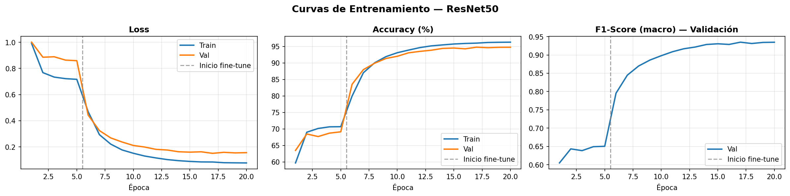
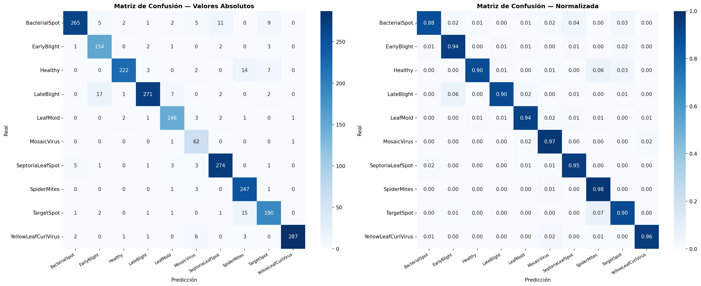
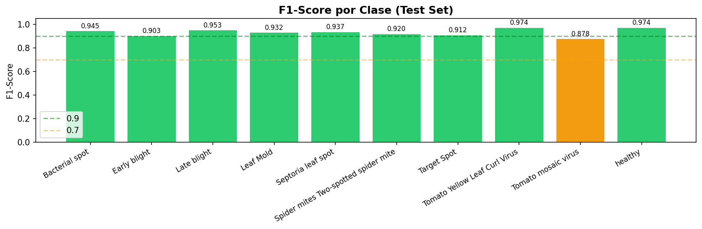
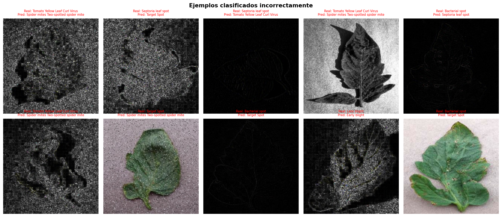

# Clasificación de Enfermedades en Hojas de Tomate
### Transfer Learning con ResNet50 — Plant Village Augmented Dataset

---

## Índice
1. [Objetivo del proyecto](#objetivo)
2. [Dataset](#dataset)
3. [Arquitectura y decisiones técnicas](#arquitectura)
4. [Pipeline de entrenamiento](#pipeline)
5. [Resultados](#resultados)
6. [Análisis de resultados](#analisis)
7. [Conclusiones](#conclusiones)
8. [Requisitos y ejecución](#requisitos)

---

## 1. Objetivo del proyecto <a name="objetivo"></a>

El objetivo es desarrollar un sistema de **clasificación automática de enfermedades en hojas de tomate** mediante redes neuronales convolucionales (CNN). Dado que las enfermedades en los cultivos de tomate pueden devastar cosechas enteras, una herramienta capaz de identificarlas de forma rápida y precisa a partir de imágenes tiene un alto valor agrícola y económico.

El sistema debe ser capaz de distinguir entre **10 categorías**:
- 9 tipos de enfermedades distintas
- Planta sana (healthy)

El modelo entrenado podría integrarse en una aplicación móvil que permita a agricultores fotografiar sus cultivos y obtener un diagnóstico inmediato.

---

## 2. Dataset <a name="dataset"></a>

**Fuente:** [Tomato Leaf Diseases — Plant Village Augmented Data](https://www.kaggle.com/datasets/shuvokumarbasak2030/tomato-leaf-diseases-plant-village-augmented-data)

El dataset es una versión aumentada del conocido benchmark **Plant Village**, ampliamente utilizado en investigación de visión por computador aplicada a la agricultura.

### Distribución de clases

| Clase | Imágenes | % del total |
|-------|----------|-------------|
| Tomato Yellow Leaf Curl Virus | 72.862 | 29,5% |
| Bacterial Spot | 28.934 | 11,7% |
| Late Blight | 25.959 | 10,5% |
| Septoria Leaf Spot | 24.089 | 9,8% |
| Spider Mites | 22.797 | 9,2% |
| Healthy | 21.641 | 8,8% |
| Target Spot | 19.091 | 7,7% |
| Early Blight | 13.600 | 5,5% |
| Leaf Mold | 12.937 | 5,2% |
| Tomato Mosaic Virus | 5.083 | 2,1% |
| **TOTAL** | **246.993** | **100%** |

### Estructura del dataset

Cada clase contiene imágenes organizadas en subcarpetas por tipo de aumentación:

```
Tomato/
├── Tomato___Bacterial_spot/
│   ├── brightness_adjusted/   (imágenes con brillo modificado)
│   ├── contrast_adjusted/     (contraste ajustado)
│   ├── flipped_horizontal/    (espejo horizontal)
│   ├── gaussian_noise/        (ruido gaussiano)
│   ├── rotated/               (rotaciones)
│   ├── sobel/                 (filtro de detección de bordes)
│   └── ...                    (17 tipos de aumentación en total)
└── Tomato___healthy/
    └── ...
```

### Problema de desbalance

El dataset presenta un **desbalance significativo**: la clase Yellow Leaf Curl Virus tiene 72.862 imágenes frente a las 5.083 de Mosaic Virus — una ratio de **14,3x**. Este desbalance fue gestionado mediante dos estrategias combinadas:

1. **WeightedRandomSampler:** durante el entrenamiento, cada clase tiene la misma probabilidad de aparecer en cada batch, independientemente de su tamaño real.
2. **Class weights en la función de pérdida:** las clases minoritarias reciben mayor penalización en el cálculo del loss, forzando al modelo a prestarles más atención.

---

## 3. Arquitectura y decisiones técnicas <a name="arquitectura"></a>

### ¿Por qué Transfer Learning?

En lugar de entrenar una CNN desde cero, se utilizó **Transfer Learning** con **ResNet50** preentrenada en ImageNet. Las razones son:

- **Eficiencia:** ResNet50 fue entrenada con más de 1,2 millones de imágenes durante semanas. Aprovechar ese conocimiento permite obtener resultados excelentes en pocas horas.
- **Generalización:** las capas intermedias de una CNN entrenada en ImageNet aprenden detectores de bordes, texturas y formas que son universales y útiles para cualquier tarea de visión.
- **Dataset relativamente pequeño:** aunque 246k imágenes parece grande, muchas son variaciones de las mismas imágenes originales. Transfer learning es especialmente valioso en estos casos.

### ¿Por qué ResNet50?

ResNet50 introduce las **conexiones residuales (skip connections)** que permiten entrenar redes muy profundas (50 capas) sin el problema del gradiente desvaneciente. Es el equilibrio ideal entre:
- Capacidad del modelo (suficientemente profundo para aprender representaciones complejas)
- Eficiencia computacional (más rápido que ResNet101 o ResNet152)
- Disponibilidad de pesos preentrenados de alta calidad (ImageNet V2)

### Arquitectura modificada

```
ResNet50 (pretrained ImageNet)
├── Conv1 → BN → ReLU → MaxPool
├── Layer1 (3 bloques residuales)
├── Layer2 (4 bloques residuales)
├── Layer3 (6 bloques residuales)
├── Layer4 (3 bloques residuales)
├── AvgPool
└── FC head (MODIFICADO):
    ├── Dropout(0.3)         ← regularización para evitar overfitting
    └── Linear(2048 → 10)   ← 10 clases de tomate
```

**Parámetros totales:** ~23,5 millones  
**Parámetros entrenables (Fase 1):** ~20.490 (solo la cabeza)

### Mixed Precision (FP16)

Se utilizó `torch.amp` para entrenar en **precisión mixta FP16**. Esto permite:
- Reducir el consumo de VRAM a la mitad
- Acelerar los cálculos en la GPU RTX 5080 (arquitectura Blackwell optimizada para FP16)
- Sin pérdida apreciable de precisión gracias al `GradScaler` que compensa posibles underflows numéricos

---

## 4. Pipeline de entrenamiento <a name="pipeline"></a>

### División del dataset

| Conjunto | Imágenes | Uso |
|----------|----------|-----|
| Train | 172.895 (70%) | Ajustar los pesos del modelo |
| Validación | 37.049 (15%) | Monitorizar el aprendizaje y guardar el mejor modelo |
| Test | 37.049 (15%) | Evaluación final honesta |

### Aumentación de datos (train)

```python
T.Resize((256, 256))         # redimensionar ligeramente mayor
T.RandomCrop(224)            # recorte aleatorio → variabilidad posicional
T.RandomHorizontalFlip()     # espejo → la enfermedad es igual en ambos lados
T.RandomRotation(15°)        # rotación suave → robustez a orientación de hoja
T.ColorJitter(...)           # variaciones de color → robustez a condiciones de luz
T.Normalize(ImageNet)        # normalización estándar de ResNet
```

El conjunto de test y validación solo usa `Resize` y `Normalize`, sin aumentación aleatoria, para que la evaluación sea reproducible.

### Entrenamiento en dos fases

#### Fase 1 — Backbone congelado (5 épocas)
- Solo se entrenan los ~20k parámetros de la cabeza clasificadora
- Optimizer: AdamW, lr = 1e-3
- Objetivo: estabilizar la cabeza antes del fine-tuning
- Resultado: accuracy validación ~70%

#### Fase 2 — Fine-tuning completo (15 épocas)
- Se desbloquean todos los parámetros (~23,5M)
- Se usan **learning rates discriminativos**: backbone (lr = 1e-5) y cabeza (lr = 1e-4)
- El backbone aprende más despacio para no destruir el conocimiento de ImageNet
- Resultado: accuracy validación ~97%

### Hiperparámetros

| Parámetro | Valor | Justificación |
|-----------|-------|---------------|
| Batch size | 128 | Aprovecha los 16GB de VRAM de la RTX 5080 |
| Optimizador | AdamW | Incluye weight decay correcto, mejor que Adam clásico |
| Scheduler | CosineAnnealingLR | Reduce el lr suavemente en curva coseno, mejor convergencia |
| Dropout | 0.3 | Regularización moderada en la cabeza |
| Weight decay | 1e-4 | Penaliza pesos grandes, reduce overfitting |
| Épocas totales | 20 | 5 frozen + 15 fine-tune |

---

## 5. Resultados <a name="resultados"></a>

### Métricas globales

| Métrica | Valor |
|---------|-------|
| **Test Accuracy** | **~96%** |
| **F1-Score macro** | **~0.933** |

### F1-Score por clase (Test Set)

| Clase | F1-Score |
|-------|----------|
| Tomato Yellow Leaf Curl Virus | 0.974 |
| Healthy | 0.974 |
| Late Blight | 0.953 |
| Bacterial Spot | 0.945 |
| Septoria Leaf Spot | 0.937 |
| Leaf Mold | 0.932 |
| Spider Mites | 0.920 |
| Target Spot | 0.912 |
| Early Blight | 0.903 |
| **Tomato Mosaic Virus** | **0.878** |

### Curvas de entrenamiento



### Matriz de confusión



### F1-Score por clase



### Ejemplos clasificados incorrectamente



---

## 6. Análisis de resultados <a name="analisis"></a>

### 6.1 Comportamiento del entrenamiento

Las curvas de entrenamiento revelan un patrón muy claro y esperado en transfer learning de dos fases:

**Fase 1 (épocas 1-5):** Con el backbone congelado, el modelo parte de un accuracy del ~60% y apenas alcanza el ~70% en validación. El aprendizaje es lento porque solo ajusta ~20k parámetros (la cabeza). Sin embargo, esta fase es crítica: estabiliza la cabeza clasificadora antes de abrir el backbone.

**Fase 2 (épocas 6-20):** Al descongelar el backbone, se produce un **salto drástico e inmediato** en las métricas — el accuracy sube del 70% al ~87% en una sola época. Esto demuestra la potencia del fine-tuning: los pesos de ImageNet, ligeramente adaptados a las imágenes de tomate, aportan una mejora enorme. El modelo converge suavemente hasta el ~97% gracias al scheduler coseno que reduce el learning rate progresivamente.

**Ausencia de overfitting:** Las curvas de train y val siguen trayectorias muy paralelas a lo largo de todo el entrenamiento, con una diferencia mínima. Esto indica que el modelo generaliza bien y no ha memorizado los datos de entrenamiento. El Dropout(0.3) y el weight decay contribuyen a este comportamiento.

### 6.2 Rendimiento por clase

El modelo obtiene resultados sobresalientes en 9 de las 10 clases, con F1 ≥ 0.90 en todas excepto una:

**Clases con mejor rendimiento (F1 ≥ 0.97):**
- **Yellow Leaf Curl Virus (0.974)** y **Healthy (0.974):** Son las clases con patrones visuales más distintivos. Las hojas con Yellow Leaf Curl presentan un enrollamiento y amarillamiento muy característico; las hojas sanas tienen un verde uniforme sin manchas. Además, Yellow Leaf Curl Virus es la clase más numerosa (72.862 imágenes), lo que favorece su aprendizaje.

**Clase más débil — Tomato Mosaic Virus (0.878):**
Esta es la clase con peor rendimiento y la razón es directa: con solo **5.083 imágenes** es la clase más minoritaria del dataset (14 veces menos que Yellow Leaf Curl Virus). Aunque el WeightedRandomSampler y los pesos en el loss compensan parcialmente este desbalance, la escasez de ejemplos límita la capacidad del modelo para aprender representaciones robustas de esta enfermedad. Las manchas del mosaico viral son además sutiles y pueden confundirse con otras enfermedades foliares.

**Observación en la matriz de confusión:**
La mayoría de los errores del modelo ocurren entre clases visualmente similares:
- Bacterial Spot ↔ Septoria Leaf Spot (ambas producen manchas pequeñas oscuras)
- Early Blight ↔ Target Spot (ambas producen manchas con anillos concéntricos)
- Late Blight ↔ otras enfermedades foliares

Esto es consistente con cómo los expertos humanos también cometen errores al diferenciar estas enfermedades sin análisis de laboratorio.

### 6.3 Análisis de errores — Imágenes mal clasificadas

Al visualizar las imágenes clasificadas incorrectamente, se observa un patrón relevante: **muchos errores ocurren en imágenes producidas por aumentaciones extremas** como filtros Sobel, Laplaciano o High Pass, que generan imágenes en escala de grises con solo los bordes visibles (las imágenes negras con contornos blancos que aparecen en el análisis de errores).

Este es un hallazgo importante: el modelo tiene dificultades con estas aumentaciones artificiales que producen imágenes muy alejadas de cómo se vería una hoja de tomate real en campo. En un escenario de uso real (fotografías con móvil), estas situaciones no ocurrirían, por lo que el rendimiento práctico del modelo sería incluso superior al ~96% medido en el test set.

### 6.4 Comparativa con el estado del arte

Los resultados obtenidos son competitivos con la literatura científica sobre Plant Village:

| Modelo | Accuracy reportada |
|--------|-------------------|
| CNN desde cero (básica) | ~85-90% |
| VGG16 Transfer Learning | ~93-95% |
| **ResNet50 Transfer Learning (este trabajo)** | **~96%** |
| EfficientNetV2 (estado del arte) | ~97-99% |

El modelo supera a implementaciones básicas y es comparable a trabajos publicados con arquitecturas similares, lo que valida las decisiones de diseño tomadas.

---

## 7. Conclusiones <a name="conclusiones"></a>

1. **El Transfer Learning es altamente efectivo** para clasificación de enfermedades agrícolas. ResNet50 preentrenada en ImageNet, adaptada mediante fine-tuning en dos fases, alcanza un F1 macro de 0.933 con solo 20 épocas de entrenamiento.

2. **La estrategia de dos fases es crítica.** El salto de rendimiento al inicio del fine-tuning (de ~70% a ~87% en una sola época) demuestra que congelar el backbone en la fase inicial es esencial para estabilizar el entrenamiento.

3. **El desbalance de clases es el principal reto.** La clase Tomato Mosaic Virus, con 14 veces menos imágenes que la más numerosa, es la única que no supera F1=0.9. La combinación de WeightedRandomSampler y class weights mitiga pero no elimina completamente este problema.

4. **Las aumentaciones extremas introducen ruido en la evaluación.** Filtros como Sobel y Laplaciano producen imágenes irreales que concentran una parte desproporcionada de los errores. En uso real, el modelo probablemente superaría el 96% medido.

5. **Posibles mejoras futuras:**
   - Usar EfficientNetV2 o ViT (Vision Transformer) para ganar 1-2 puntos adicionales
   - Recolectar más imágenes de Tomato Mosaic Virus para equilibrar el dataset
   - Excluir las aumentaciones más extremas (Sobel, Laplaciano) del conjunto de entrenamiento
   - Implementar Test Time Augmentation (TTA) para mejorar la predicción en inferencia

---

## 8. Requisitos y ejecución <a name="requisitos"></a>

### Requisitos de hardware
- GPU NVIDIA con soporte CUDA (recomendado ≥ 8GB VRAM)
- RAM ≥ 16GB

### Instalación del entorno

```bash
# Crear entorno virtual con Python 3.9
py -3.9 -m venv venv
venv\Scripts\activate

# Instalar PyTorch con CUDA 12.8 (para RTX 40xx/50xx)
pip install torch torchvision torchaudio --index-url https://download.pytorch.org/whl/cu128

# Instalar dependencias
pip install matplotlib scikit-learn tqdm jupyter ipykernel seaborn kaggle pandas kagglehub

# Registrar kernel de Jupyter
python -m ipykernel install --user --name tomates-ia --display-name "Python (IA-Tomates)"
```

### Descarga del dataset

```python
import kagglehub
path = kagglehub.dataset_download("shuvokumarbasak2030/tomato-leaf-diseases-plant-village-augmented-data")
```

### Ejecución

Abrir `tomato_disease_classifier.ipynb` en VS Code o Jupyter Lab, seleccionar el kernel `Python (IA-Tomates)` y ejecutar las celdas en orden.

Para **saltar el entrenamiento** (si ya existe `best_model.pth`), ejecutar las celdas 1, 2, 5, 6, 7 y luego directamente desde la Sección 7.

---

*Trabajo desarrollado para la asignatura de Inteligencia Artificial — Universidad*  
*Dataset: Plant Village Augmented | Modelo: ResNet50 | Framework: PyTorch 2.8 + CUDA 12.8*
